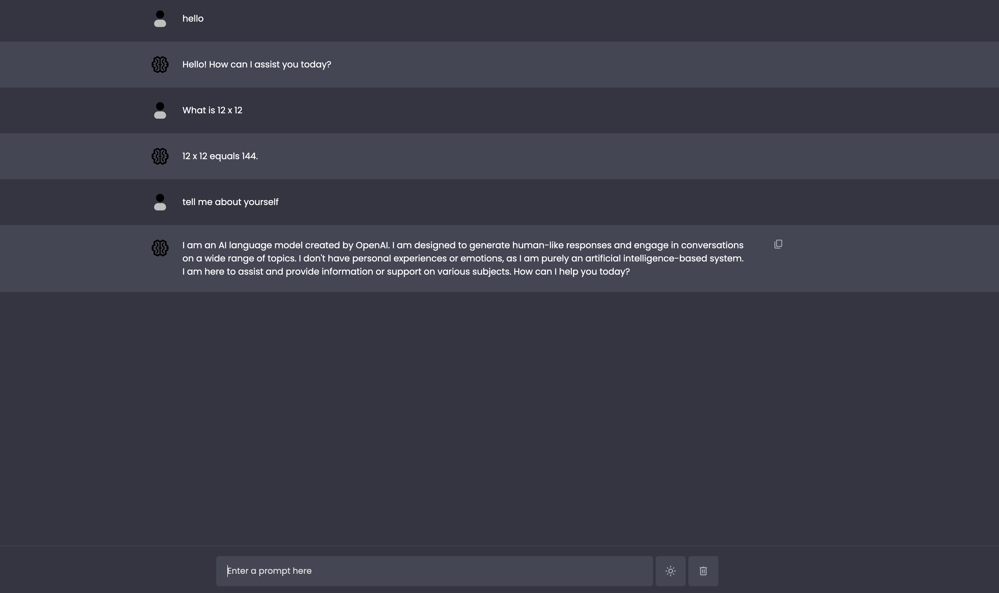

<!-- PROJECT LOGO -->
 

  <h1 align="center">ChatGPT AI</h1>

  

    This is a chat GPT clone created using HTML, CSS, and JavaScript. It utilizes the power of GPT-4 language model to provide intelligent responses in a chat-like interface. 
    <a href="https://github.com/shawndreifuss/ai-project"><strong>Explore the docs »</strong></a>
     
     
    <a href="https://musical-valkyrie-913a7e.netlify.app/">View Demo</a>
  

<!-- TABLE OF CONTENTS -->

  
Table of Contents

  <ol>
    <li>
      <a href="#about-the-project">About The Project</a>
      <ul>
        <li><a href="#built-with">Built With</a></li>
      </ul>
    </li>
    <li><a href="#features">Features</li>
    <li>
      <a href="#getting-started">Getting Started</a>
      <ul>
        <li><a href="#installation">Installation</a></li>
      </ul>
    </li>
    <li><a href="#usage">Usage</a></li>
    <li><a href="#contact">Contact</a></li>
  </ol>

<!-- ABOUT THE PROJECT -->
## About The Project

The Chat GPT Clone is a project aimed at replicating the conversational abilities of GPT-4 in a user-friendly chat application. It allows users to interact with the AI-powered model and receive responses based on the input provided.It has a light and dark mode and can also save chats to local storage and delete them.

(<a href="#readme-top">back to top</a>)

### Built With

- JavaScript: The programming language used for the application logic.
- HTML: The markup language for structuring the application.
- CSS: Responsive Design

(<a href="#readme-top">back to top</a>)

## Features

- **Real-time Chat**: Engage in a dynamic conversation with the AI model in real-time.
- **Intelligent Responses**: Benefit from the advanced language processing capabilities of GPT-4 to receive accurate and contextually relevant answers.
- **User-Friendly Interface**: Enjoy a clean and intuitive interface designed for seamless user experience.
- **Customizable Styling**: Modify the HTML and CSS files to personalize the look and feel of the chat application.

(<a href="#readme-top">back to top</a>)

<!-- GETTING STARTED -->
## Getting Started

These are instructions on setting up your project locally.
To get a local copy up and running follow these simple example steps.

### Installation

To run the Chat GPT Clone locally, follow these steps:

1. Clone the repository: `git clone https://github.com/your-username/chat-gpt-clone.git`
2. Navigate to the project directory: `cd chat-gpt-clone`
3. Open the `index.html` file in your preferred web browser.

<!-- USAGE EXAMPLES -->
## Usage
Create a free account and upload a profile image to begin, once you have signed up you can then use 
this chat application to message friends, family or anyone that creates an account. With the search feature you can find anyone by their display name and begin!

(<a href="#readme-top">back to top</a>)

<!-- LICENSE -->
## License

This project is licensed under the [MIT License](https://opensource.org/licenses/MIT).

(<a href="#readme-top">back to top</a>)

## Acknowledgements

- The Chat GPT Clone was inspired by OpenAI's GPT-4 language model.
- Special thanks to the developers and contributors of the HTML, CSS, and JavaScript libraries used in this project.

<!-- CONTACT -->
## Contact

Shawn Dreifuss  - ShawnDreifuss@icloud.com

Project Link: [https://github.com/shawndreifuss/chat-app](https://github.com/shawndreifuss/chat-app)

(<a href="#readme-top">back to top</a>)

<!-- MARKDOWN LINKS & IMAGES -->
<!-- https://www.markdownguide.org/basic-syntax/#reference-style-links -->
[license-shield]: https://img.shields.io/github/license/othneildrew/Best-README-Template.svg?style=for-the-badge
[license-url]: https://www.linkedin.com/in/shawn-dreifuss-a1a60023b/
[linkedin-shield]: https://img.shields.io/badge/-LinkedIn-black.svg?style=for-the-badge&logo=linkedin&colorB=555
[linkedin-url]: https://www.linkedin.com/in/shawn-dreifuss-a1a60023b/
[linkedin-shield]: https://img.shields.io/badge/-LinkedIn-black.svg?style=for-the-badge&logo=linkedin&colorB=555
[linkedin-url]: https://linkedin.com/in/othneildrew
[contributors-shield]: https://img.shields.io/github/contributors/github_username/repo_name.svg?style=for-the-badge
[contributors-url]: https://github.com/github_username/repo_name/graphs/contributors
[forks-shield]: https://img.shields.io/github/forks/github_username/repo_name.svg?style=for-the-badge
[forks-url]: https://github.com/github_username/repo_name/network/members
[stars-shield]: https://img.shields.io/github/stars/github_username/repo_name.svg?style=for-the-badge
[stars-url]: https://github.com/github_username/repo_name/stargazers
[issues-shield]: https://img.shields.io/github/issues/github_username/repo_name.svg?style=for-the-badge
[issues-url]: https://github.com/github_username/repo_name/issues
[license-shield]: https://img.shields.io/github/license/github_username/repo_name.svg?style=for-the-badge
[license-url]: https://github.com/github_username/repo_name/blob/master/LICENSE.txt
[linkedin-shield]: https://img.shields.io/badge/-LinkedIn-black.svg?style=for-the-badge&logo=linkedin&colorB=555
[linkedin-url]: https://linkedin.com/in/linkedin_username
[product-screenshot]: images/screenshot.png
[Next.js]: https://img.shields.io/badge/next.js-000000?style=for-the-badge&logo=nextdotjs&logoColor=white
[Next-url]: https://nextjs.org/
[React.js]: https://img.shields.io/badge/React-20232A?style=for-the-badge&logo=react&logoColor=61DAFB
[React-url]: https://reactjs.org/
[Vue.js]: https://img.shields.io/badge/Vue.js-35495E?style=for-the-badge&logo=vuedotjs&logoColor=4FC08D
[Vue-url]: https://vuejs.org/
[Angular.io]: https://img.shields.io/badge/Angular-DD0031?style=for-the-badge&logo=angular&logoColor=white
[Angular-url]: https://angular.io/
[Svelte.dev]: https://img.shields.io/badge/Svelte-4A4A55?style=for-the-badge&logo=svelte&logoColor=FF3E00
[Svelte-url]: https://svelte.dev/
[Laravel.com]: https://img.shields.io/badge/Laravel-FF2D20?style=for-the-badge&logo=laravel&logoColor=white
[Laravel-url]: https://laravel.com
[Bootstrap.com]: https://img.shields.io/badge/Bootstrap-563D7C?style=for-the-badge&logo=bootstrap&logoColor=white
[Bootstrap-url]: https://getbootstrap.com
[JQuery.com]: https://img.shields.io/badge/jQuery-0769AD?style=for-the-badge&logo=jquery&logoColor=white
[JQuery-url]: https://jquery.com 